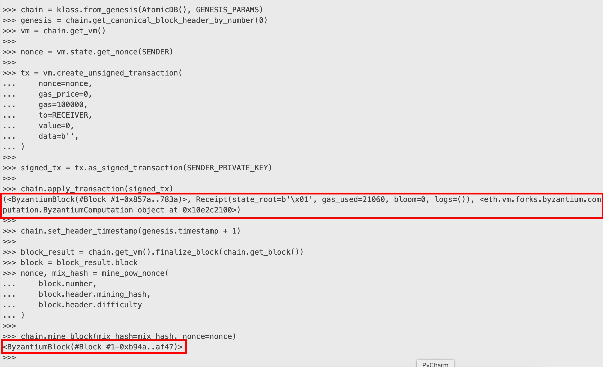

# 程式碼步驟簡易說明
  - 進入 python3
```
  from eth_keys import keys
  from eth_utils import decode_hex
  from eth_typing import Address
  from eth import constants
  from eth.chains.base import MiningChain
  from eth.consensus.pow import mine_pow_nonce
  from eth.vm.forks.byzantium import ByzantiumVM
  from eth.db.atomic import AtomicDB

  GENESIS_PARAMS = {
      'difficulty': 1,
      'gas_limit': 3141592,
      # 'timestamp': 1514764800,
  }

  SENDER_PRIVATE_KEY = keys.PrivateKey(
      decode_hex('0x45a915e4d060149eb4365960e6a7a45f334393093061116b197e3240065ff2d8')
  )

  SENDER = Address(SENDER_PRIVATE_KEY.public_key.to_canonical_address())

  RECEIVER = Address(b'\0\0\0\0\0\0\0\0\0\0\0\0\0\0\0\0\0\0\0\x02')

  klass = MiningChain.configure(
      __name__='TestChain',
      vm_configuration=(
          (constants.GENESIS_BLOCK_NUMBER, ByzantiumVM),
      ))

  chain = klass.from_genesis(AtomicDB(), GENESIS_PARAMS)
  genesis = chain.get_canonical_block_header_by_number(0)
  vm = chain.get_vm()

  nonce = vm.state.get_nonce(SENDER)

  tx = vm.create_unsigned_transaction(
      nonce=nonce,
      gas_price=0,
      gas=100000,
      to=RECEIVER,
      value=0,
      data=b'',
  )

  signed_tx = tx.as_signed_transaction(SENDER_PRIVATE_KEY)

  chain.apply_transaction(signed_tx)
  # 交易發出
  # (<ByzantiumBlock(#Block #1-0x857a..783a)>, Receipt(state_root=b'\x01', gas_used=21060, bloom=0, logs=()), <eth.vm.forks.byzantium.computation.ByzantiumComputation object at 0x10e2c2100>)

  chain.set_header_timestamp(genesis.timestamp + 1)

  block_result = chain.get_vm().finalize_block(chain.get_block())
  block = block_result.block
  nonce, mix_hash = mine_pow_nonce(
      block.number,
      block.header.mining_hash,
      block.header.difficulty
  )

  chain.mine_block(mix_hash=mix_hash, nonce=nonce)
  # 礦工對交易挖礦
  #  (<ByzantiumBlock(#Block #1-0xb94a..af47)>

```

# Output 截圖

